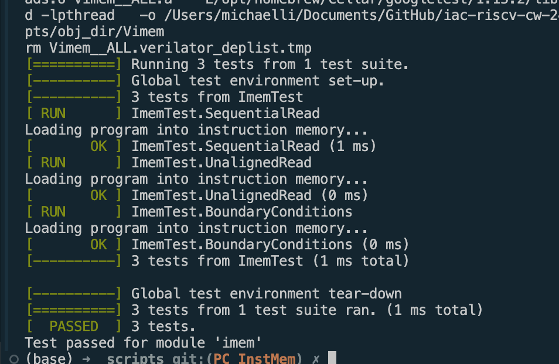
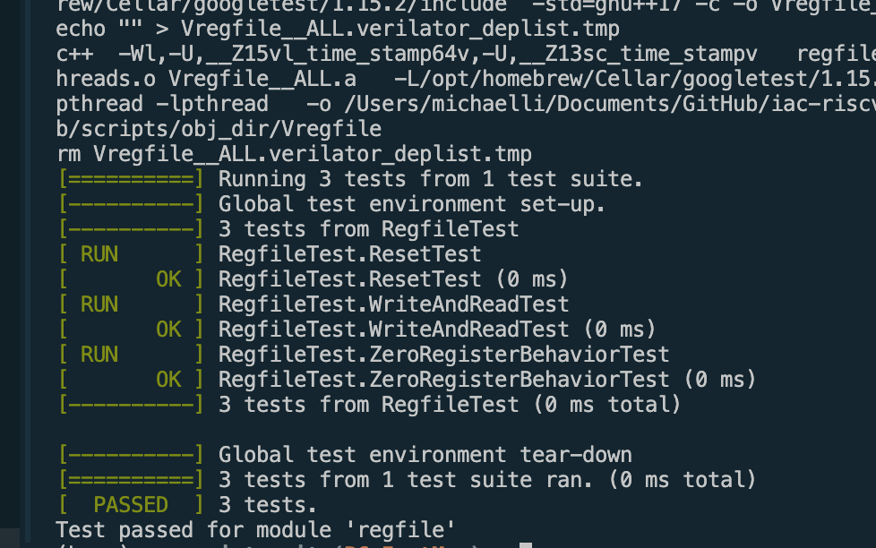
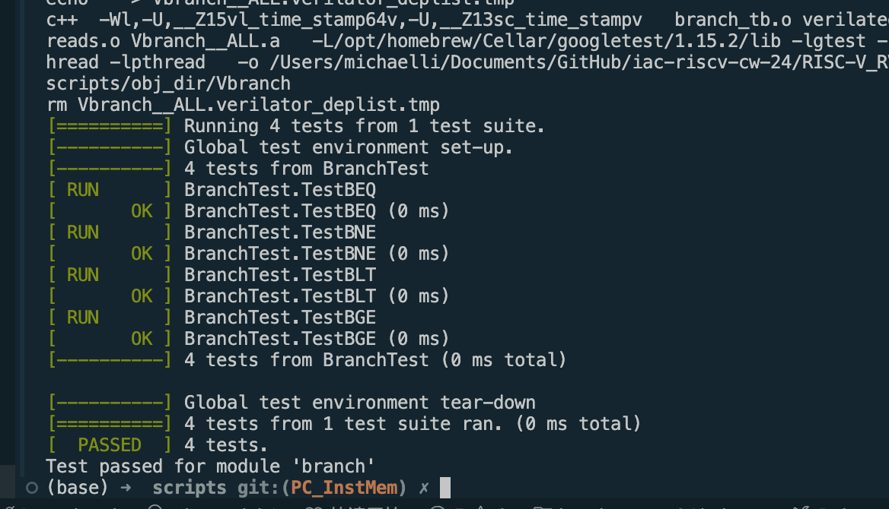
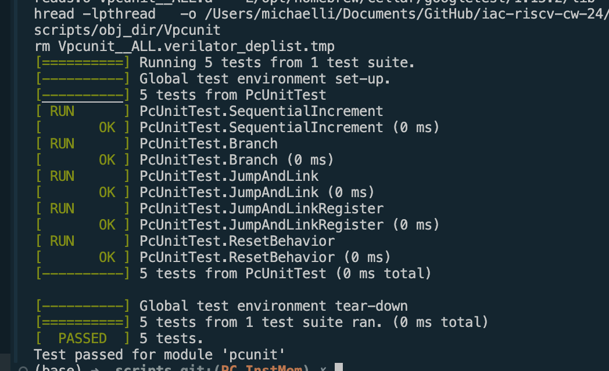
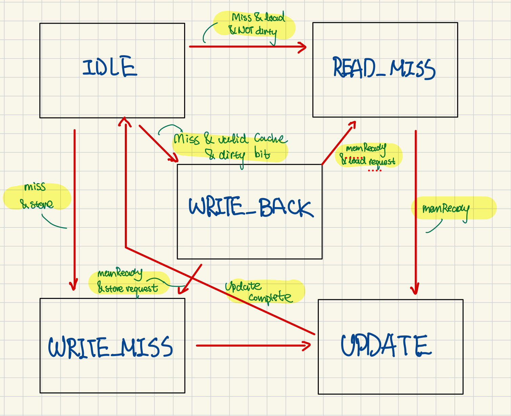
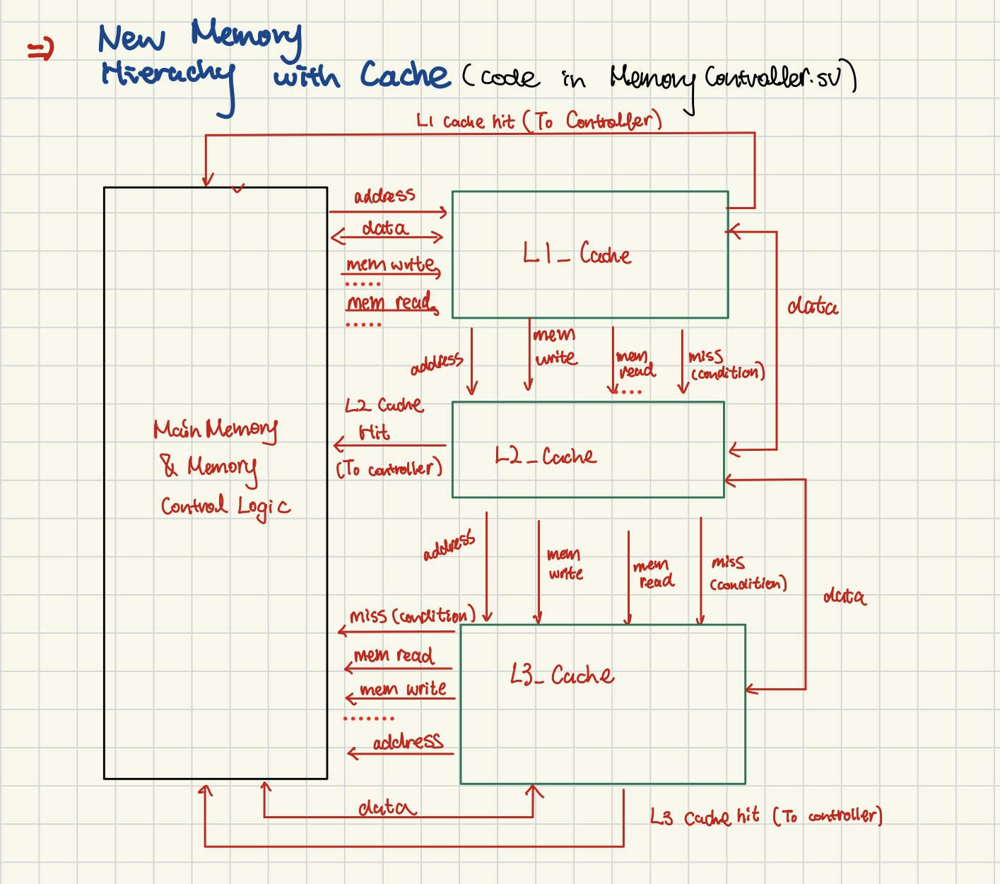

# Personal Statement for RISC-V RV32I Processor Coursework

### Statement Overview

- [Personal Statement for RISC-V RV32I Processor Coursework](#personal-statement-for-risc-v-rv32i-processor-coursework)
    - [Statement Overview](#statement-overview)
  - [1. CPU Design and Implementation: A Personal Journey](#1-cpu-design-and-implementation-a-personal-journey)
    - [1.1 Initial Group Work Allocation](#11-initial-group-work-allocation)
    - [1.2 Single Cycle Component Work](#12-single-cycle-component-work)
    - [1.3 Testing and Validation](#13-testing-and-validation)
  - [2. Cache System Design and Implementation Analysis](#2-cache-system-design-and-implementation-analysis)
    - [2.1 Core Cache Architecture](#21-core-cache-architecture)
      - [Cache Line Structure](#cache-line-structure)
    - [2.2 Cache Array Organization](#22-cache-array-organization)
    - [2.3 Address Decomposition Algorithm](#23-address-decomposition-algorithm)
      - [Address Fields](#address-fields)
    - [2.4 Hit Detection Logic](#24-hit-detection-logic)
  - [3. Cache Controller State Machine](#3-cache-controller-state-machine)
    - [Detailed Analysis](#detailed-analysis)
    - [3.1 State Definitions](#31-state-definitions)
    - [3.2 State Details](#32-state-details)
      - [IDLE State](#idle-state)
      - [WRITE\_BACK State](#write_back-state)
      - [READ\_MISS State](#read_miss-state)
      - [WRITE\_MISS State](#write_miss-state)
      - [UPDATE State](#update-state)
  - [4. LRU Implementation Details](#4-lru-implementation-details)
    - [4.1 LRU Bit Structure](#41-lru-bit-structure)
    - [4.2 LRU Update Logic Diagram](#42-lru-update-logic-diagram)
    - [4.3 LRU Decision Process](#43-lru-decision-process)
    - [4.4 LRU Implementation Analysis](#44-lru-implementation-analysis)
  - [5. Memory Controller Design](#5-memory-controller-design)
    - [5.1 Controller Interface](#51-controller-interface)
    - [5.2 Cache Level Interconnection](#52-cache-level-interconnection)
    - [5.3 L1/L2/L3 Cache IO](#53-l1l2l3-cache-io)
    - [6. Optimization and Future Directions](#6-optimization-and-future-directions)
  - [7. Reflections and Learnings](#7-reflections-and-learnings)
    - [7.1 Deep Dive into Cache Design](#71-deep-dive-into-cache-design)
    - [7.2 Team Collaboration and Git Management](#72-team-collaboration-and-git-management)
    - [7.3 Testbench Development](#73-testbench-development)
  - [Acknowledgement \& Conclusion](#acknowledgement--conclusion)


## 1. CPU Design and Implementation: A Personal Journey

### 1.1 Initial Group Work Allocation

The first week was dedicated to understanding the fundamentals of a full-cycle single CPU. This period was marked by intense study and hands-on exploration, Our group started allocation of work distribution, which I have been assigned with the following parts: 
1. Single-Cycle CPU
    - Controller Units
    - Instruction Memory
    - Unit Testing
2. Cache: Two-Way Set Associate & Integration
3. Full RISCV CPU Implementation

### 1.2 Single Cycle Component Work

As the start of the project, I began to develop individual components of the CPU, each in its own SystemVerilog file with Unit Testing and Testbenches for further development before integration. This modular approach allowed for a systematic and organized development process. Here's a detailed breakdown of the components I worked with:

1. **Controller.sv**: The controller module managed the overall operation of the CPU, coordinating between different components to ensure smooth execution of instructions, since I have developed this part in the Lab 4. I modified the control units to implement more instructions. While our group used a simplified version for Pipelining, I developed this Controller which was used later in Stretched Goal.

- To decode RISC-V instructions and generate control signals for components like the ALU, register file, memory, and PC, I designed and implemented a RISC-V controller module in SystemVerilog. Below is a breakdown of the design process and key implementation details:

Key Instruction Mapping Example
| **Instruction Type** | **Key Signals**                                    | **Logic Implemented**                                             |
|-----------------------|---------------------------------------------------|--------------------------------------------------------------------|
| **R-Type**            | `rf_wen_o = 1`, ALU operation via `funct3_i`/`funct7_i` | Configures ALU for register-based operations like ADD, AND, etc.  |
| **I-Type**            | `alu_src2_sel_o = 01`, `imm_type_o = IMM_I`       | Handles immediate values for ALU operations (e.g., ADDI, ORI).    |
| **Load**              | `rf_wen_o = 1`, `rf_wdata_sel_o = 01`             | Reads from memory and writes to a register.                       |
| **Store**             | `mem_wen_o = 1`, `imm_type_o = IMM_S`             | Writes data from a register to memory.                            |
| **Branch**            | `next_pc_sel_o` set via branch condition signals  | Updates PC based on conditions like BEQ or BLT.                   |
| **Jump (JAL/JALR)**   | `rf_wdata_sel_o = 10`, `next_pc_sel_o = 10/11`    | Saves return address and jumps to target.                         |

- and I have also implemnted all the different cases in the module using a case scenario.

- To verify that this works, I improved the testbench files I used for Lab4, adding new testing logics for Branch and Load type instructions, with also illegal instructions to verify the workability of this submodule:

- **Controller Unit Testbench**


2. **Instruction Memory (imem.sv)**: These modules simulated the memory components of a real CPU, allowing for the storage and retrieval of data and instructions.

- The Instruction Memory (IMEM) module is responsible for storing and providing instructions to the processor. It is implemented as a byte-addressable memory array and supports reading 32-bit instructions. 

- **Instruction Fetching**
	•	Addressing Scheme: The input **addr_i** specifies the address of the instruction to fetch. Since RISC-V instructions are 32 bits (4 bytes) wide, the **addr_i** is divided:
	•	**addr_i[11:2]**: Determines the base address of the instruction in word-aligned format.
	•	**2'b00, 2'b01, 2'b10, 2'b11**: Specify which byte of the word to fetch.
	•	Combining Bytes: The always_ff block combines four consecutive bytes from the memory array to form a 32-bit instruction:
 ```systemverilog
	•	mem[{addr_i[11:2], 2'b11}]: Most significant byte (MSB).
	•	mem[{addr_i[11:2], 2'b10}]: Second byte.
	•	mem[{addr_i[11:2], 2'b01}]: Third byte.
	•	mem[{addr_i[11:2], 2'b00}]: Least significant byte (LSB).
 ```
- To verify this works and my groupmate could use it in the later stage when integration, I also made unit testbench with it with test functions of: 
  - Sequential Read
  - Unaligned Read
  - Boundary Conditions
- InstructionMemory Testbench


### 1.3 Testing and Validation

To ensure the correctness and reliability of the designs, I meticulously wrote unit test benches for most of the majority component in the design. These test benches simulated various scenarios and edge cases, allowing me to identify and rectify any issues before integrate it in the design. The process of testing and validation was iterative, with each iteration bringing us closer to a fully functional and efficient CPU.

- Register File Test:

- Branch Test

- Data Memory Test

- PC Unit Test

- ALU Test


Evidence in this folder Under the Branch PC&Instmem: [Link]

## 2. Cache System Design and Implementation Analysis

### 2.1 Core Cache Architecture
####  Cache Line Structure
Since one of the stretched goals was to specifically designa a two way set associate cache, so we have started to design the first cache based on this structure. :

```systemverilog
typedef struct packed {
    logic valid;           // Valid bit
    logic dirty;           // Dirty bit for write-back
    logic [TAG_WIDTH-1:0] tag;  // Tag bits
    logic [DATA_WIDTH-1:0] data; // Actual data
} line_t;
```

This structure is the fundamental building block for each cache line. The tag width is dynamically calculated based on the set width:
```systemverilog
parameter TAG_WIDTH = DATA_WIDTH - SET_WIDTH - 2
```

### 2.2 Cache Array Organization
```systemverilog
line_t cache[2**SET_WIDTH][2];  // Two-way set associative
logic [2**SET_WIDTH-1:0] lru;   // LRU bits for each set
```

The cache is organized as a 2D array where:
- First dimension: Number of sets (2^SET_WIDTH)
- Second dimension: Two ways (fixed for two-way set associative)

### 2.3 Address Decomposition Algorithm

#### Address Fields
```systemverilog
logic [TAG_WIDTH-1:0] tag;
logic [SET_WIDTH-1:0] index;
logic way;
logic hit_way;

assign tag = address[DATA_WIDTH-1:SET_WIDTH+2];
assign index = address[SET_WIDTH+1:2];
```

### 2.4 Hit Detection Logic
```systemverilog
always_comb begin
    hit = 0;
    hit_way = 0;

    if (cache[index][0].valid && cache[index][0].tag == tag) begin
        hit = 1;
        hit_way = 0;
    end else if (cache[index][1].valid && cache[index][1].tag == tag) begin
        hit = 1;
        hit_way = 1;
    end

    way = lru[index];
    if (!cache[index][0].valid) way = 0;
    else if (!cache[index][1].valid) way = 1;
end
```

1.	Cache Hit Detection:
•	**Initializes** hit (indicating a cache hit) and hit_way (indicating the cache way that hit) to 0.
•	**Checks** the validity (valid) and tag match of each cache line (**cache[index][0]** and **cache[index][1]**):
•	If **cache[index][0]** is **valid** and its tag matches the input tag, it sets hit = 1 and hit_way = 0.
•	If **cache[index][1]** is **valid** and its tag matches, it sets hit = 1 and hit_way = 1.
2.	Replacement Way Selection:
•	Uses the Least Recently Used (LRU) mechanism **(lru[index])** to select the replacement way by default.
•	Overrides the LRU decision:
•	If **cache[index][0]** is invalid, selects way 0 (way = 0).
•	If **cache[index][1]** is invalid, selects way 1 (way = 1).

## 3. Cache Controller State Machine

### Detailed Analysis

To provide a detailed analysis of the cache design, I created a hierarchy diagram that illustrated the structure and interactions of the various components involved. This diagram served as a visual aid, helping me and my team understand the flow of data and control within the cache system.

### 3.1 State Definitions
```verilog
typedef enum logic [2:0] {
    IDLE,
    READ_MISS,
    WRITE_MISS,
    WRITE_BACK,
    UPDATE
} state_t;
```


### 3.2 State Details

#### IDLE State
```systemverilog
IDLE: begin
    if (miss) begin
        busy <= 1;
        if (cache[index][way].valid && cache[index][way].dirty) begin
            mem_write <= 1;
            state <= WRITE_BACK;
        end else if (load) begin
            mem_read <= 1;
            state <= READ_MISS;
        end else begin
            state <= WRITE_MISS;
        end
    end else begin
        busy <= 0;
        mem_write <= 0;
        mem_read <= 0;
        if (hit && store) begin
            cache[index][hit_way].data <= data_in;
            cache[index][hit_way].dirty <= 1;
            lru[index] <= !hit_way;
        end else if (store) begin
            cache[index][way].dirty <= 1;
        end
    end
end
```

Key Operations:
1. Hit detection
2. Miss handling initiation
3. LRU update on hits
4. Dirty bit management

#### WRITE_BACK State
```systemverilog
WRITE_BACK: begin
    if (mem_ready) begin
        mem_write <= 0;
        mem_read <= load;
        state <= load ? READ_MISS : WRITE_MISS;
    end
end
```

Key Operations:
1. Write dirty data to memory
2. Wait for memory acknowledgment
3. Transition based on original operation

#### READ_MISS State
```systemverilog
READ_MISS: begin
    if (mem_ready) begin
        mem_read <= 0;
        state <= UPDATE;
    end
end
```

Key Operations:
1. Wait for memory read completion
2. Prepare for cache update

#### WRITE_MISS State
```systemverilog
WRITE_MISS: begin
    state <= UPDATE;
end
```

Key Operations:
1. Direct transition to update
2. No memory wait required

#### UPDATE State
```systemverilog
UPDATE: begin
    busy <= 0;
    cache[index][way].valid <= 1;
    cache[index][way].dirty <= store;
    cache[index][way].tag <= tag;
    cache[index][way].data <= store ? data_in : mem_data;
    lru[index] <= !way;
    state <= IDLE;
end
```

Key Operations:
1. Update cache line
2. Set validity and dirty bits
3. Update LRU
4. Return to IDLE

## 4. LRU Implementation Details

### 4.1 LRU Bit Structure
```systemverilog
logic [2**SET_WIDTH-1:0] lru;  // One bit per set
```

### 4.2 LRU Update Logic Diagram


```mermaid
flowchart TD
    A[Memory Access] --> B{Cache Hit or Miss?}
    B -->|Hit| C[Cache Hit Update]
    B -->|Miss| D[Cache Miss Update]

    %% Cache Hit Logic
    C --> C1[Locate Cache Line in the Set]
    C1 --> C2[Update LRU Bits for Accessed Cache Line]
    C2 --> E[Continue Program]

    %% Cache Miss Logic
    D --> D1[Locate Target Set Using Index Bits]
    D1 --> D2[Find LRU Block in the Set]
    D2 --> F[Evict LRU Cache Line]
    F --> G[Load New Memory Block to LRU Line]
    G --> H[Update LRU Bits to Reflect New Cache Line Usage]
    H --> E
```

### 4.3 LRU Decision Process

1. **On Cache Hit:**
```systemverilog
if (hit && store) begin
    cache[index][hit_way].data <= data_in;
    cache[index][hit_way].dirty <= 1;
    lru[index] <= !hit_way;  // Mark other way as LRU
end
```

2. **On Cache Miss:**
```systemverilog
way = lru[index];  // Select LRU way for replacement
if (!cache[index][0].valid) way = 0;
else if (!cache[index][1].valid) way = 1;
```

3. **After Replacement:**
```systemverilog
lru[index] <= !way;  // Mark current way as most recently used
```

### 4.4 LRU Implementation Analysis

The LRU implementation uses a single bit per set where:
- `lru[index] = 0`: Way 1 is least recently used
- `lru[index] = 1`: Way 0 is least recently used

Benefits of this implementation:
1. Minimal hardware overhead (single bit per set)
2. Simple update logic
3. Fast LRU determination
4. Efficient way selection

## 5. Memory Controller Design
The original memory hierachy design from pipeline looked like this with the processor:


To integrate the design with caches, I implemented based on the original DataMemory.sv, and Renamed it as MemoryController, with the following logic of how the interior design looks like:

### 5.1 Controller Interface
```systemverilog
module MemoryController #(
    parameter DATA_WIDTH = 32,
    parameter ADDR_WIDTH = 17
) (
    input  logic                   clk,
    input  logic                   rst_n,
    input  logic                   MemWrite,
    input  logic [2:0]            SizeCtr,
    input  logic [ADDR_WIDTH-1:0] addr,
    input  logic [DATA_WIDTH-1:0] WriteData,
    output logic [DATA_WIDTH-1:0] ReadData,
    output logic                  MemReady
);
```

### 5.2 Cache Level Interconnection
The memory controller manages the interconnection between cache levels through internal signals:

```systemverilog
// L1 Cache signals
logic l1_hit, l1_miss, l1_mem_write, l1_mem_read, l1_busy;
logic [DATA_WIDTH-1:0] l1_data_out, l1_mem_write_data;

// L2 Cache signals
logic l2_hit, l2_miss, l2_mem_write, l2_mem_read, l2_busy;
logic [DATA_WIDTH-1:0] l2_data_out, l2_mem_write_data;

// L3 Cache signals
logic l3_hit, l3_busy;
logic [DATA_WIDTH-1:0] l3_data_out;
```

### 5.3 L1/L2/L3 Cache IO

The three levels of cache—L1, L2, and L3—share a similar design in terms of inputs and outputs, with the main difference being their size, latency, and sometimes associativity. Each level takes the same inputs, including memory addresses, data, and control signals (e.g., read/write), and outputs retrieved data and status signals (e.g., hit/miss). The fundamental operations, such as checking for data, fetching on a hit, or forwarding a miss to the next level, remain consistent across all levels. However, L1 is smaller and faster, optimized for immediate CPU access, while L2 and L3 progressively increase in size and latency to handle larger data sets efficiently.

```systemverilog
L1Cache #(
    .DATA_WIDTH(DATA_WIDTH),
    .SET_WIDTH(5)
) l1_cache (
    .clk(clk),
    .rst_n(rst_n),
    .load(!MemWrite && mem_access),
    .store(MemWrite && mem_access),
    .address({15'b0, addr}),
    .data_in(WriteData),
    .mem_data(l2_data_out),
    .mem_ready(!l2_busy),
    // Other connections
);
```

The provided code snippet demonstrates how the three levels of cache (L1, L2, and L3) interact to retrieve data in a hierarchical caching system. The logic prioritizes the lowest-level cache with a hit: if the data is in L1 (l1_hit), it is retrieved from l1_data_out, and the system signals readiness (MemReady = 1). If L1 misses, the system checks L2 (l2_hit), and similarly, if L2 misses, it checks L3 (l3_hit). If all cache levels miss, the data is retrieved from main memory (main_mem_data), with MemReady only signaling readiness when the main memory is prepared, and none of the caches are busy (!l1_busy, !l2_busy, !l3_busy). This logic ensures efficient data retrieval by prioritizing faster, smaller caches and falling back to main memory as a last resort.

```systemverilog
always_comb begin
    if (l1_hit) begin
        ReadData = l1_data_out;
        MemReady = 1;
    end else if (l2_hit) begin
        ReadData = l2_data_out;
        MemReady = 1;
    end else if (l3_hit) begin
        ReadData = l3_data_out;
        MemReady = 1;
    end else begin
        ReadData = main_mem_data;
        MemReady = main_mem_ready_reg && !l1_busy && !l2_busy && !l3_busy;
    end
end
```

### 6. Optimization and Future Directions

Reflecting on the cache design process, I recognize that there are several areas where further optimization is possible. For instance, exploring different replacement algorithms could enhance the cache's efficiency and reduce latency. Additionally, incorporating prefetching mechanisms could further improve the system's performance by anticipating and fetching data before it is needed.

## 7. Reflections and Learnings

### 7.1 Deep Dive into Cache Design

The process of designing the cache was both challenging and enlightening. Initially, my understanding of caches was limited to their role as a bridge between data memory and the CPU. However, through this project, I gained a profound appreciation for the intricacies of cache design and its impact on system performance. I learned about various caching strategies, such as direct-mapped, set-associative, and fully associative caches, each with its own trade-offs in terms of complexity, cost, and performance.

Moreover, I delved into advanced topics such as cache coherence and consistency, which are crucial for multi-core systems. Understanding these concepts has sparked my interest in more advanced memory systems, including virtual memory and memory management units (MMUs).

### 7.2 Team Collaboration and Git Management

This project marked my first experience using Git for collaborative software development. The ability to track changes, manage branches, and merge code was invaluable, especially given the complexity and scale of our project. Through Git, I could monitor my teammates' progress, provide feedback, and contribute to the project in a structured and efficient manner.

Learning to navigate the Git workflow and resolve merge conflicts has significantly enhanced my software development skills. It has also taught me the importance of clear communication and coordination in team projects.

### 7.3 Testbench Development

Developing comprehensive testbenches was a critical aspect of ensuring the correctness and reliability of our designs. I invested significant time in writing and refining testbenches for each component, simulating various scenarios to uncover potential issues. This process taught me the importance of thorough testing and validation in the development lifecycle.

## Acknowledgement & Conclusion

The RISC-V RV32I Processor Coursework has been an invaluable learning experience, providing me with a deep understanding of CPU design, cache mechanisms, and collaborative software development. Through this project, I have not only honed my technical skills but also gained valuable insights into the complexities of system design and optimization. Looking ahead, I am eager to apply these learnings to more advanced projects and further explore the fascinating world of computer architecture and memory systems.